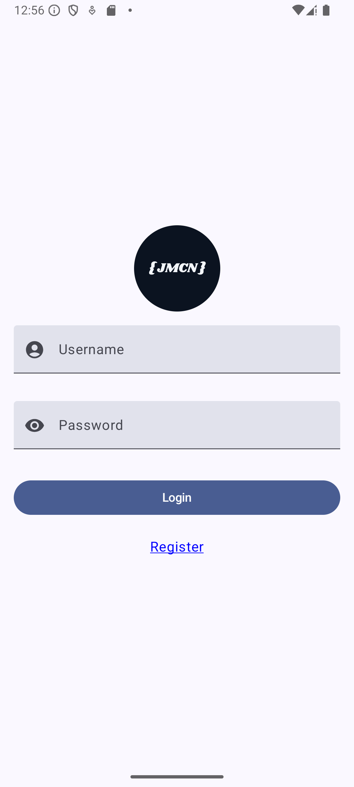
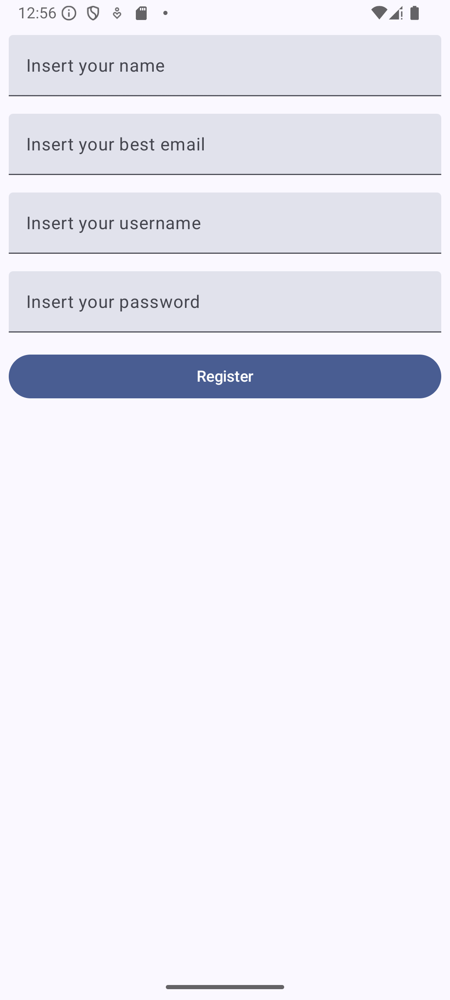

# Fluxo de login com compose

Aplicativo para praticar conhecimentos adiquiridos em compose

Desenvolvida tela de cadastro e de registro, criado também a navegação

| Tela de Login                  | Tela de Registro                         | Tela principal recendo nome do usuário
|------------------------------------|--------------------------------------------------|------------------------------------------------|
|  |  |  |

Ultilizados:
* KOTLIN (linguagem de progração)
* COMPOSE (desenvolvimento das telas)
* NAVIGATION COMPOSE (navegação entre as telas)
